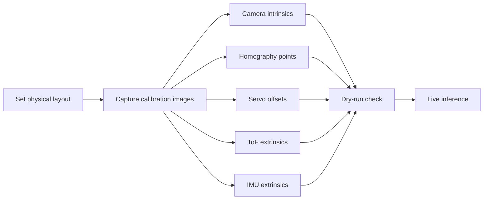

# Calibration and Deployment

This document explains the calibration artifacts that the runtime expects and the steps needed before live deployment.

## Calibration Files

The runtime expects calibration data under `rpi5_inference/calibration/` once the camera and workspace are fixed.

The usual files are:

- `camera_intrinsics.yaml`
- `homography.yaml`
- `servo_offsets.yaml`
- `workspace_corners.yaml`
- `tof_extrinsics.yaml`
- `imu_extrinsics.yaml`

The repository does not currently include these files, so they should be created from the physical setup later.

## What Each Calibration Does

- Camera intrinsics define the lens model and distortion.
- Homography maps image coordinates into workspace coordinates.
- Servo offsets trim the mechanical zero positions.
- Workspace corners define the usable area on the table.
- ToF extrinsics describe how the distance sensor is mounted.
- IMU extrinsics align the IMU frame with the end effector frame.

## Camera Workflow

The chat history for the project ended up using a side-mounted camera on a tripod with a fixed angle and height, then corrected the perspective with calibration points on the workspace paper. The important part is not the exact mount style by itself, but that the same geometry is preserved every time.

Recommended deployment rule set:

- Mark the camera position before calibration.
- Keep the tripod or mount rigid.
- Keep the workspace paper in the same location.
- Recompute homography if the camera or table shifts.

## Deployment Sequence

1. Put the robot, workspace, and camera into the final physical layout.
2. Capture calibration images.
3. Create the camera and homography YAML files.
4. Verify the YOLO detector on the live camera stream.
5. Verify pose estimation on known reference points.
6. Run `python -m rpi5_inference.main --dry-run`.
7. Run live inference with the serial link connected.

## Calibration Workflow Diagram

## Why This Matters

The project is designed to work even when the camera is not perfectly overhead, but only if calibration is done carefully. Without calibration, pose estimation and reach planning will drift.
