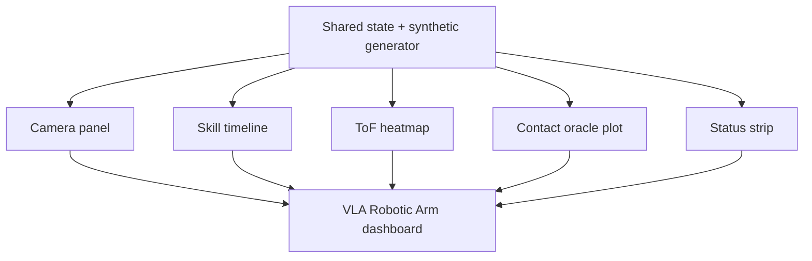

# Dashboard and Monitoring

The dashboard is a PyQt6 application that shows a synthetic but realistic live view of the full system.

## Purpose

The dashboard is meant to give quick visual feedback during development and testing. It is especially useful before the physical hardware is available because it can run entirely on synthetic data.

## Panels

The GUI contains five panels:

1. Camera feed with synthetic cube detections.
2. Skill timeline showing recent REACH / GRASP / LIFT / PLACE states.
3. Wrist ToF heatmap with 8 x 8 depth cells.
4. Contact oracle plot with IMU RMS and gripper load.
5. Status strip with latency, skill name, safety state, wrist Z, and loop frequency.

## Dashboard Layout Diagram

## Synthetic Data Behavior

The data generator cycles through the four skills and simulates realistic sensor patterns:

- IMU RMS spikes during GRASP.
- Gripper load increases during grasp and lift phases.
- ToF readings move toward the target in the grasp phase.
- The simulated object position moves around the workspace.

## Why It Exists

The dashboard helps with:

- debugging the runtime logic,
- validating the shared state structure,
- checking that telemetry is flowing,
- and demonstrating the system even before the robot is fully deployed.

## Practical Usage

Run it as a standalone window from the package entry point. When hardware is later connected, the synthetic generator can be replaced with real telemetry and frame data while keeping the UI structure unchanged.
