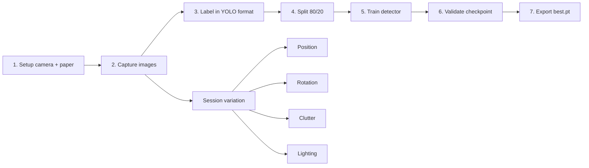

# Dataset Generation

This document explains how the object detector dataset was created and how the final YOLO dataset is organized.

## Dataset Goal

The detector only needs to recognize three classes on a white background:

- red_cube
- blue_cube
- green_cube

The cubes are hand-painted styrofoam blocks, which gives enough visual variation for a compact but effective detector.

## What Was Collected

The final image dataset contains 301 images total across 12 capture sessions.

Session counts recorded during the dataset build were:

- red_s1: 27
- red_s2: 21
- red_s3: 25
- red_s4: 26
- blue_s1: 27
- blue_s2: 22
- blue_s3: 24
- blue_s4: 26
- green_s1: 28
- green_s2: 21
- green_s3: 24
- green_s4: 30

## How The Images Were Captured

The dataset was collected without needing the arm present in frame. The object detector only needs the cubes themselves, not the arm hardware.

Practical capture rules:

- Keep the background consistent and bright.
- Keep the camera position and angle fixed across the session.
- Keep the cube classes visually distinct under the same lighting.
- Include multi-object scenes so the detector sees real-world clutter.

## Session Design

The capture set was built around four patterns for each color:

1. Single cube at varied positions.
2. Single cube with varied rotations.
3. Target cube plus one distractor cube.
4. All three cubes in frame with shadow variation.

That structure gives the detector enough positional and contextual variation without turning the dataset into a noisy general-purpose object set.

## Dataset Capture Workflow



## Labeling Workflow

The first export path used Roboflow and then converted the annotations locally.

Important points:

- The Roboflow export needed class remapping so the final order is red_cube = 0, blue_cube = 1, green_cube = 2.
- The exported annotations were polygons first, then converted to YOLO bounding boxes.
- Final labels are standard YOLO detection labels with five values per line.

Example format:

```txt
class_id center_x center_y width height
```

## Final Dataset Layout

The final dataset folder is structured as:

```text
vla_cubes.v1i.yolov8 2/
├── data.yaml
├── train/
│   ├── images/
│   └── labels/
└── valid/
    ├── images/
    └── labels/
```

## Current Class Mapping

The active class order used by training is:

```yaml
names: ['red_cube', 'blue_cube', 'green_cube']
```

## Why The Dataset Works Well

This is a relatively easy detection problem because:

- The background is uniform.
- The classes differ primarily by color.
- The camera is fixed.
- The objects are large enough relative to the frame.
- The class list is small.

That combination is why the detector converged quickly and reached very high validation metrics.

## Where Future Images Will Go

When new photos are added later, they should be placed into the image slots listed in [Figure and Image Slots](figures_and_image_slots.md).
