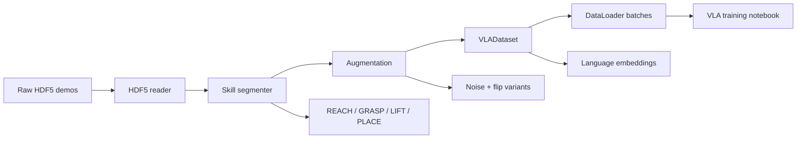

# Dataset Pipeline and VLA Training

This document explains how teleoperation data becomes training data for the VLA model.

## Pipeline Summary

The pipeline is:

1. Read raw HDF5 demos.
2. Segment each timestep into REACH, GRASP, LIFT, or PLACE.
3. Apply augmentation.
4. Wrap the result in a PyTorch dataset.
5. Feed batches into the Colab training notebook.

## Training Data Flow

## Core Files

- `dataset/hdf5_reader.py` - loads demo files and structured telemetry.
- `dataset/skill_segmenter.py` - assigns skill labels.
- `dataset/augmentation.py` - creates augmented copies of each sample.
- `dataset/vla_dataset.py` - returns model-ready tensors.

## Demo File Format

Each HDF5 file is expected to contain:

- `/telemetry` as raw 250-byte telemetry rows.
- `/rgb_frames` as overhead RGB images.
- `/frame_ts` as frame timestamps.
- Root attributes for `instruction` and `task_type`.

## Skill Segmentation

The current segmentation logic uses physical thresholds rather than learned labels.

The rules are driven by values such as:

- contact load threshold,
- velocity stop threshold,
- lift height threshold,
- lift joint angle threshold,
- ToF approach threshold.

The result is a clean four-phase skill chain:

- REACH
- GRASP
- LIFT
- PLACE

## Augmentation

The augmentation pipeline currently supports four modes:

- identity,
- joint noise,
- joint plus load noise,
- horizontal flip with base-joint sign flip.

This is enough to expand a small demo set without changing the underlying task semantics.

## VLADataset Output

Each item from `VLADataset` returns model-ready tensors for:

- RGB image,
- normalized joint state,
- one-hot skill label,
- contact signal,
- ToF scalar,
- language embedding,
- future joint deltas,
- scalar skill label.

## Why The Dataset Layer Matters

The VLA model does not train directly on raw HDF5 files. It needs a consistent tensor format with fixed shapes and clear semantics. This layer does the conversion and keeps the training code simpler.

## Colab Training Flow

The Colab notebook should be run top-to-bottom:

1. Mount Drive and install dependencies.
2. Point to the demo folder.
3. Load and segment demos.
4. Build the augmented training set.
5. Create `VLADataset` and data loaders.
6. Define the policy model.
7. Train with validation checks.
8. Export a deployable checkpoint.

The long-form training guide lives in [VLA_Training_README.md](../VLA_Training_README.md).
