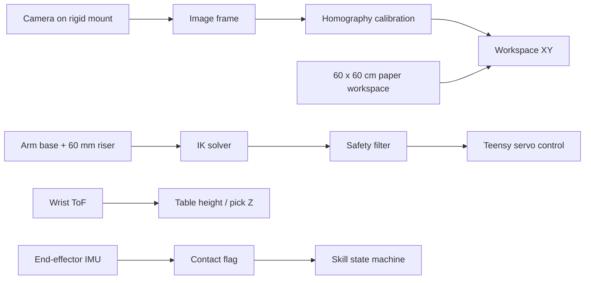

# Hardware and Workspace

This document describes the physical setup used by the project and the values that the software expects.

## Core Hardware

- Arm: 4-DOF arm with 5 STS3215 servos.
- Controller: Teensy 4.1 for the low-level loop.
- Companion computer: Raspberry Pi 5 for inference and orchestration.
- Sensors: wrist ToF grid and end-effector IMU.
- Camera: overhead or angled camera mounted on a rigid stand or tripod.
- Objects: 1 x 1 x 1 inch styrofoam cubes painted red, blue, and green.

## Locked Arm Parameters

From `rpi5_inference/config/arm_config.yaml`:

```yaml
dh_params:
  d1_mm: 125
  a2_mm: 130
  a3_mm: 190

joint_limits_min_deg: [-150, -30, -120, 0]
joint_limits_max_deg: [150, 60, 30, 90]

workspace:
  x_m: [-0.19, 0.19]
  y_m: [0.10, 0.26]
  z_m: [0.025, 0.12]
```

These values are used by the IK solver and the safety filter.

## Workspace Interpretation

The current software assumes a conservative workspace centered around the arm base:

- X range is symmetric left/right.
- Y range is the forward reach band used for pick and place.
- Z range keeps the gripper above the table but below the arm's mechanical ceiling.

The capture workflow discussed in the project chat used a side-mounted camera and a paper workspace boundary, then relied on calibration points to map image coordinates into workspace coordinates. That means the software should not assume the camera is perfectly vertical unless calibration has been done.

## Physical Layout Diagram



## Camera Placement Notes

The important operational rule is consistency:

- Keep the camera mount rigid.
- Do not move the tripod or camera angle after calibration.
- Reuse the same paper boundary and reference points every session.
- If the camera changes, recalibrate before trusting pose estimates.

## Serial and Control Timing

- Teensy telemetry: 250 bytes at 50 Hz.
- Teensy command packets: 20 bytes at 8 Hz.
- Main inference loop: 8 Hz, with an overrun threshold of 125 ms.

## Why The Workspace Matters

The workspace geometry is not just a drawing exercise. It directly affects:

- inverse kinematics reachability,
- camera-to-workspace projection,
- object placement for the dataset,
- and the safety filter's clamping behavior.

If the real table geometry changes, the calibration files and workspace limits need to be updated together.
