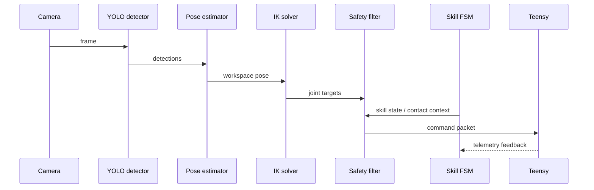

# Inference Pipeline

This document describes the live runtime path in `rpi5_inference/main.py`.

## Runtime Modes

The entry point supports two modes:

- Live mode: connect to the camera and Teensy and run until Ctrl-C.
- Dry-run mode: import every module, run smoke tests, and exit without hardware.

Dry-run is useful for confirming that the codebase still imports after edits.

## Main Loop Sequence

At 8 Hz, the runtime performs this sequence:

1. Read the latest telemetry from the Teensy.
2. Capture or load a camera frame.
3. Run YOLO detection.
4. Match the detection to the language instruction.
5. Estimate object pose in workspace coordinates.
6. Solve IK.
7. Clamp the joint command through the safety filter.
8. Update the skill state.
9. Send the final command packet to the Teensy.

## Inference Loop Diagram

## Module Roles

- `planning/ik_solver.py` - closed-form inverse kinematics and forward kinematics.
- `planning/safety_filter.py` - workspace and joint-limit protection.
- `vla/skill_predictor.py` - REACH / GRASP / LIFT / PLACE state machine.
- `language/language_encoder.py` - converts instructions to embeddings.
- `perception/yolo_detector.py` - loads the cube detector and returns detections.
- `perception/pose_estimation.py` - maps image detections into workspace coordinates.
- `comms/teensy_serial.py` - serial protocol and telemetry parsing.

## Timing

The loop is designed around a 125 ms budget.

- Target frequency: 8 Hz.
- Overrun threshold: 125 ms.
- The code logs any loop that takes longer than the budget.

## Safe Hold Behavior

If no target is visible or IK fails, the loop falls back to a safe hold posture instead of sending an undefined joint command.

## Dry-Run Checks

The dry-run path confirms that:

- all modules import,
- key constants are present,
- the IK round-trip works,
- the safety filter can clamp invalid commands,
- the skill state machine can complete a full cycle,
- and the serial packet sizes are correct.

That makes it a good regression check before hardware testing.
