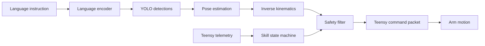

# Project Overview

The project is a vision-language-action robotic arm system for tabletop pick, place, sorting, and stacking tasks. A natural-language instruction such as "pick up the red cube" is converted into perception, planning, and low-level joint commands. The system is designed around a 4-DOF arm, an overhead or angled camera setup, wrist ToF sensing, end-effector IMU contact detection, and a Teensy-controlled servo loop.

## What The System Does

The runtime path is:

1. Read camera frames and telemetry.
2. Detect objects with YOLO.
3. Estimate object pose in workspace coordinates.
4. Map the target to a joint target with inverse kinematics.
5. Clamp the command through a safety filter.
6. Track the current skill state in the REACH -> GRASP -> LIFT -> PLACE chain.
7. Send the final command to the Teensy over serial.

## System Workflow

## Current Status

The following parts are already implemented in the repo:

- Trained object detector checkpoint at `checkpoints/yolov8n_vla/weights/best.pt`.
- Inference modules for IK, safety filtering, language encoding, pose estimation, YOLO detection, serial comms, and the main loop.
- Dataset pipeline for HDF5 reading, skill segmentation, augmentation, and PyTorch dataset wrapping.
- PyQt dashboard for synthetic monitoring.
- README and Colab training guidance.

## What Was Learned From The Physical Setup Work

The project was adapted to a practical tabletop workflow:

- The workspace is a 60 x 60 cm white paper surface.
- The arm base is mounted near the edge rather than in the middle.
- The camera is not assumed to be perfectly overhead at capture time, so homography calibration is part of the workflow.
- The dataset uses three color classes only: red_cube, blue_cube, and green_cube.

## Who This Documentation Is For

- A new teammate who needs to understand the project quickly.
- Anyone preparing calibration files or demo recordings.
- Anyone building on the existing model checkpoints and codebase.
- Anyone preparing a report or project submission from the current state of work.
