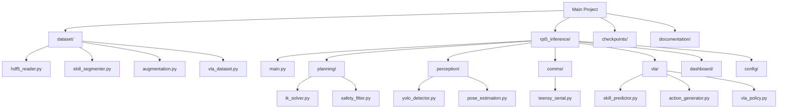

# Repository Structure

This file explains the layout of the codebase at a glance.

## Top-Level Layout

```text
Main Project/
├── README.md
├── VLA_Training_README.md
├── documentation/
├── requirements.txt
├── checkpoints/
│   └── yolov8n_vla/weights/best.pt
├── dataset/
│   ├── __init__.py
│   ├── augmentation.py
│   ├── hdf5_reader.py
│   ├── skill_segmenter.py
│   └── vla_dataset.py
├── rpi5_inference/
│   ├── __init__.py
│   ├── main.py
│   ├── comms/
│   │   ├── __init__.py
│   │   └── teensy_serial.py
│   ├── config/
│   │   ├── arm_config.yaml
│   │   └── model_config.yaml
│   ├── dashboard/
│   │   ├── __init__.py
│   │   └── gui.py
│   ├── evaluation/
│   │   ├── __init__.py
│   │   └── run_eval.py
│   ├── language/
│   │   ├── __init__.py
│   │   └── language_encoder.py
│   ├── perception/
│   │   ├── __init__.py
│   │   ├── camera_manager.py
│   │   ├── pose_estimation.py
│   │   └── yolo_detector.py
│   ├── planning/
│   │   ├── __init__.py
│   │   ├── ik_solver.py
│   │   └── safety_filter.py
│   └── vla/
│       ├── __init__.py
│       ├── action_generator.py
│       ├── skill_predictor.py
│       └── vla_policy.py
```

The repository does not yet include a checked-in `rpi5_inference/calibration/` folder. That directory is generated later when the camera and workspace calibration files are created.

## Notes On Current Files

A few files exist as placeholders or empty stubs so the package structure is already in place for later expansion:

- `rpi5_inference/config/model_config.yaml` is currently empty.
- `rpi5_inference/perception/camera_manager.py` is currently empty.
- `rpi5_inference/vla/action_generator.py` is currently empty.
- `rpi5_inference/evaluation/run_eval.py` is currently empty.

That is normal for an incremental build: the interfaces exist even where the implementation is still reserved for later work.

## Why The Layout Is Useful

The split is intentional:

- `dataset/` handles offline data preparation.
- `rpi5_inference/planning/` handles geometry and safety logic.
- `rpi5_inference/perception/` handles sensing and coordinate estimation.
- `rpi5_inference/vla/` handles skill logic and learned policy behavior.
- `rpi5_inference/comms/` isolates the serial protocol.
- `rpi5_inference/dashboard/` gives a live debugging view.

This separation keeps the hardware-facing code and the training code from becoming tangled.

## Structure Diagram


