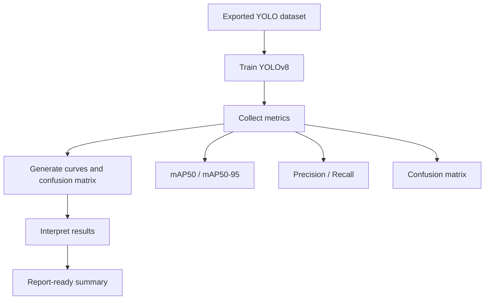

# Training and Evaluation

This document summarizes the object detector training run and the current evaluation story for the project.

## YOLO Training Result

The detector checkpoint in `checkpoints/yolov8n_vla/weights/best.pt` was trained on the three cube classes and reached the following reported metrics:

- mAP50: 0.995
- mAP50-95: 0.910
- Precision: 0.994
- Recall: 1.000
- Early stopping: epoch 77
- Best convergence: around epoch 57

## Training Set Size

The detector was trained on the exported Roboflow dataset:

- 241 training images
- 60 validation images
- 301 images total

## What The Results Mean

These numbers are strong for a small, visually simple three-class detection problem.

Interpretation:

- mAP50 near 1.0 means the detector localizes the cubes reliably.
- High recall means it rarely misses a cube in validation.
- High precision means false positives are rare.
- The small drop from mAP50 to mAP50-95 is normal because stricter overlap thresholds are harder.

## Evaluation Flow

## Suggested Figures To Include Later

Add the following plots when you are preparing the final report:

1. mAP versus epoch.
2. Training and validation loss curves.
3. Precision and recall curves.
4. Per-class mAP bar chart.
5. Confusion matrix.
6. Latency budget chart for the runtime loop.

See [Figure and Image Slots](figures_and_image_slots.md) for where each image should go.

## Evaluation Targets

The project has practical targets rather than only ML metrics:

- Task 1 pick-place success rate >= 85 percent.
- Task 2 stacking success rate >= 75 percent.
- Task 3 sorting success rate >= 80 percent.
- Inference latency <= 125 ms.
- Skill classification F1 >= 75 percent.

## Current State

The YOLO detector portion is complete and ready to use in the live inference pipeline. The next evaluation steps depend on the remaining hardware and demo data becoming available.
